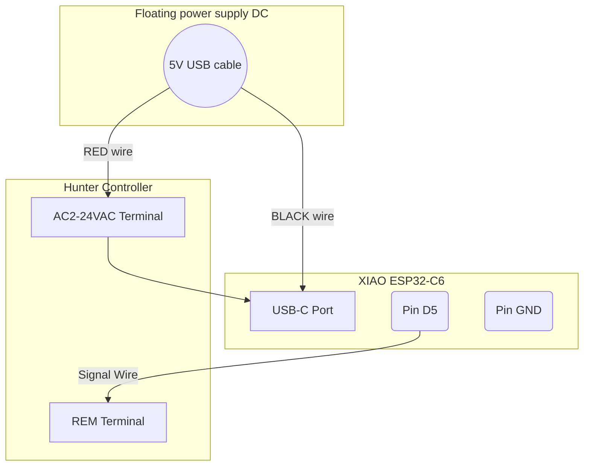

# ESP32 Zigbee Controller for Hunter Irrigation System [HA/Zigbee2MQTT]
This project transforms a standard Hunter sprinkler/irrigation controller (with a REM port) into a smart, Zigbee-enabled device, allowing for seamless integration with home automation platforms like Home Assistant/Zigbee2MQTT/ZHA.

It exposes each sprinkler zone as an individual Zigbee switch, enabling you to control your irrigation system using automations, dashboards, and voice assistants. The firmware is designed to be stateless, treating Home Assistant as the single source of truth for all schedules and timers.

## Features
- Individual Zone Control: Exposes up to 4 sprinkler (can be easily modified to support more zones) zones as separate Zigbee endpoints.

- Stateless Operation: Designed to be controlled by Home Assistant automations; the device itself holds no schedules.

- On-Device Safety Timer: Includes a 60-minute hardware safety shut-off to prevent zones from running indefinitely in case of a communication failure.

- Robust Error Handling: A watchdog timer automatically reboots the device if the main loop freezes, ensuring long-term stability.

- Resilient Connectivity: Smart startup logic allows the device to reliably rejoin the network after a power outage without losing its pairing information.

- Visual Status LED: The onboard LED provides instant feedback on the device's status:

- Blinking: Disconnected / Searching for network.

- Solid OFF: Connected and idle.

- Solid ON: Connected and at least one zone is active.

- Non-Blocking Code: The main loop is highly efficient and responsive, ensuring that Zigbee communication and other tasks are handled promptly.

## Hardware Required
- Microcontroller: A Seeed Studio XIAO ESP32-C6.

- Sprinkler Controller: Any Hunter controller that includes a REM Port (e.g., Hunter X-Core, X2).

- Power Supply: A standard 5V USB-C power adapter and cable (e.g., a mobile phone charger).

- (Recommended) A mains-powered Zigbee Router (like a smart plug) placed between your hub and the controller to ensure a strong mesh network signal. ESP32C6 signal struggled when they were crammed into the hunter controller box.

## Software Required
- Any home Automation platform: ex - Home Assistant with a Zigbee Coordinator (using Zigbee2MQTT/ZHA/etc).

- Firmware: The code in this repository 

- This is a PlatformIO project. So recommended to use pio with vscode for managing the project and libraries.

## Wiring Instructions
The wiring for this project is simple but requires one critical connection: which is using a floating power supply and using one leg of 24VAC as ground. This is because the REM port is 5VDC logic signal with respect to the 24VAC (AC2) pin. 



## Setup and Installation
- Configure the Code: Open main.cpp and adjust any configuration constants at the top of the file if needed (e.g., NUM_ZONES). The default pin (D5) is for the XIAO ESP32-C6.

- Compile and Upload: Using PlatformIO or the Arduino IDE, compile and upload the firmware to your ESP32. This project used board: XIAO ESP32-C6.

- Pairing:

    - Take the ESP32 to its final installation location near the sprinkler controller. This is crucial for it to build the correct network route.

    - In Home Assistant, navigate to your Zigbee integration (ZHA/Z2M) and enable "Permit Join" (Add Device).

    - Power on the ESP32. The onboard LED should start blinking.

    - Home Assistant should discover the device and its 4 zones. Serial console logs should look healthy. The device would log switch changes in HA.

- Final Installation: Once paired & verified, disconnect the ESP32, wire it to the Hunter controller's REM port as per the diagram, and power it back on.

## Acknowledgements
This project would not be possible without the HunterRoam C++ library which handles the low-level communication with the hunter sprinkler controller.

Shout out to the works of [Sebastien](https://github.com/seb821/OpenSprinkler-Firmware-Hunter), [Ecodina](https://github.com/ecodina/hunter-wifi), Dave Fleck, and Scott Shumate and others. 

## License
Given that [Sebastien](https://github.com/seb821/OpenSprinkler-Firmware-Hunter)/[Eloi Codina](https://github.com/ecodina/hunter-wifi) published his code under the GNU GPL v3, this project follows the same license.
```
Zigbee Irrigation Controller
Copyright (C) 2025 Komal-SkyNET (Komal Venkatesh Ganesan)

This program is free software: you can redistribute it and/or modify
it under the terms of the GNU General Public License as published by
the Free Software Foundation, either version 3 of the License, or
(at your option) any later version.

This program is distributed in the hope that it will be useful,
but WITHOUT ANY WARRANTY; without even the implied warranty of
MERCHANTABILITY or FITNESS FOR A PARTICULAR PURPOSE.  See the
GNU General Public License for more details.

You should have received a copy of the GNU General Public License
along with this program.  If not, see <https://www.gnu.org/licenses/>.
```


